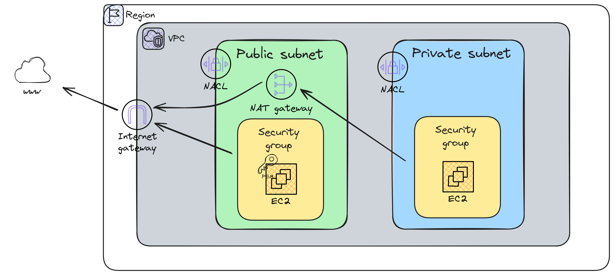

# aws-terraform-commons

Repository to play with terraform and AWS common usage resources.

This architecture is an example from [Stephane Maarek](https://pt.linkedin.com/in/stephanemaarek) AWS SysOps course.

## TO-DO

- [ ] Add RDS to diagram architecture.
- [ ] Add second private subnet to diagram architecture.