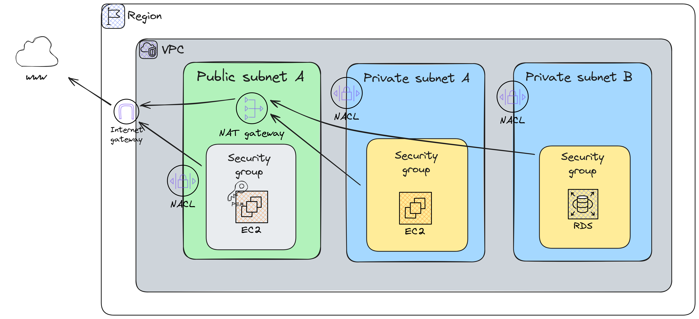

# aws-terraform-commons

Repository to play with terraform and AWS common usage resources.

This architecture is an example from [Stephane Maarek](https://pt.linkedin.com/in/stephanemaarek) AWS SysOps course.

## TO-DO

- [x] Add RDS to diagram architecture.
- [x] Add second private subnet to diagram architecture.
- [ ] Add output to the RDS reader instance.

## Requirements

| Name | Version |
|------|---------|
|  [terraform](#requirement\_terraform) | >= 1.8.2 |
|  [aws](#requirement\_aws) | >= 5.50.0 |

## Providers

| Name | Version |
|------|---------|
|  [aws](#provider\_aws) | >= 5.50.0 |
|  [http](#provider\_http) | n/a |

## Modules

No modules.

## Resources

| Name | Type |
|------|------|
| [aws_db_subnet_group.rds](https://registry.terraform.io/providers/hashicorp/aws/latest/docs/resources/db_subnet_group) | resource |
| [aws_eip.publicA](https://registry.terraform.io/providers/hashicorp/aws/latest/docs/resources/eip) | resource |
| [aws_iam_role.rds](https://registry.terraform.io/providers/hashicorp/aws/latest/docs/resources/iam_role) | resource |
| [aws_iam_role_policy_attachment.rds_attach](https://registry.terraform.io/providers/hashicorp/aws/latest/docs/resources/iam_role_policy_attachment) | resource |
| [aws_instance.private](https://registry.terraform.io/providers/hashicorp/aws/latest/docs/resources/instance) | resource |
| [aws_instance.public](https://registry.terraform.io/providers/hashicorp/aws/latest/docs/resources/instance) | resource |
| [aws_internet_gateway.dev](https://registry.terraform.io/providers/hashicorp/aws/latest/docs/resources/internet_gateway) | resource |
| [aws_key_pair.personal](https://registry.terraform.io/providers/hashicorp/aws/latest/docs/resources/key_pair) | resource |
| [aws_nat_gateway.publicA](https://registry.terraform.io/providers/hashicorp/aws/latest/docs/resources/nat_gateway) | resource |
| [aws_rds_cluster.rds_cluster](https://registry.terraform.io/providers/hashicorp/aws/latest/docs/resources/rds_cluster) | resource |
| [aws_rds_cluster_instance.rds_instance](https://registry.terraform.io/providers/hashicorp/aws/latest/docs/resources/rds_cluster_instance) | resource |
| [aws_rds_cluster_instance.rds_replica_reader](https://registry.terraform.io/providers/hashicorp/aws/latest/docs/resources/rds_cluster_instance) | resource |
| [aws_route.public_internet_gateway](https://registry.terraform.io/providers/hashicorp/aws/latest/docs/resources/route) | resource |
| [aws_route_table.private](https://registry.terraform.io/providers/hashicorp/aws/latest/docs/resources/route_table) | resource |
| [aws_route_table.public](https://registry.terraform.io/providers/hashicorp/aws/latest/docs/resources/route_table) | resource |
| [aws_route_table_association.privateA](https://registry.terraform.io/providers/hashicorp/aws/latest/docs/resources/route_table_association) | resource |
| [aws_route_table_association.publicA](https://registry.terraform.io/providers/hashicorp/aws/latest/docs/resources/route_table_association) | resource |
| [aws_security_group.private](https://registry.terraform.io/providers/hashicorp/aws/latest/docs/resources/security_group) | resource |
| [aws_security_group.public](https://registry.terraform.io/providers/hashicorp/aws/latest/docs/resources/security_group) | resource |
| [aws_subnet.privateA](https://registry.terraform.io/providers/hashicorp/aws/latest/docs/resources/subnet) | resource |
| [aws_subnet.privateB](https://registry.terraform.io/providers/hashicorp/aws/latest/docs/resources/subnet) | resource |
| [aws_subnet.publicA](https://registry.terraform.io/providers/hashicorp/aws/latest/docs/resources/subnet) | resource |
| [aws_vpc.dev](https://registry.terraform.io/providers/hashicorp/aws/latest/docs/resources/vpc) | resource |
| [aws_ami.amzn-linux-2023-ami](https://registry.terraform.io/providers/hashicorp/aws/latest/docs/data-sources/ami) | data source |
| [aws_iam_policy.AmazonRDSEnhancedMonitoringRole](https://registry.terraform.io/providers/hashicorp/aws/latest/docs/data-sources/iam_policy) | data source |
| [http_http.myip](https://registry.terraform.io/providers/hashicorp/http/latest/docs/data-sources/http) | data source |

## Inputs

| Name | Description | Type | Default | Required |
|------|-------------|------|---------|:--------:|
|  [access\_key](#input\_access\_key) | n/a | `string` | n/a | yes |
|  [common\_tags](#input\_common\_tags) | Common tags to the resources | `map(string)` | n/a | yes |
|  [instance\_type](#input\_instance\_type) | Type of EC2 instance to provision | `string` | `"t2.micro"` | no |
|  [name](#input\_name) | n/a | `string` | n/a | yes |
|  [personal\_account\_id](#input\_personal\_account\_id) | List of personal account IDs to deny terraform create | `list(string)` | n/a | yes |
|  [public\_key\_path](#input\_public\_key\_path) | Path to the public key to create the key pair | `string` | n/a | yes |
|  [rds\_backup\_retention\_period](#input\_rds\_backup\_retention\_period) | RDS backup retention period | `number` | n/a | yes |
|  [rds\_cluster\_engine](#input\_rds\_cluster\_engine) | RDS cluster engine | `string` | n/a | yes |
|  [rds\_cluster\_maintenance\_window](#input\_rds\_cluster\_maintenance\_window) | RDS maintenance window | `string` | n/a | yes |
|  [rds\_cluster\_name](#input\_rds\_cluster\_name) | Name of the RDS cluster | `string` | n/a | yes |
|  [rds\_cluster\_version](#input\_rds\_cluster\_version) | Postgre version to use | `string` | n/a | yes |
|  [rds\_database\_name](#input\_rds\_database\_name) | RDS database name | `string` | n/a | yes |
|  [rds\_deletion\_protection](#input\_rds\_deletion\_protection) | Enable RDS deletion protection | `bool` | n/a | yes |
|  [rds\_instance\_insights\_retention\_period](#input\_rds\_instance\_insights\_retention\_period) | RDS instance insights retention period | `number` | n/a | yes |
|  [rds\_instance\_minor\_version](#input\_rds\_instance\_minor\_version) | RDS instance minor version | `bool` | n/a | yes |
|  [rds\_instance\_monitoring\_interval](#input\_rds\_instance\_monitoring\_interval) | RDS instance monitoring interval, if > 0 enhanced monitoring enabled | `string` | n/a | yes |
|  [rds\_instance\_name](#input\_rds\_instance\_name) | n/a | `string` | n/a | yes |
|  [rds\_instance\_performance\_insights](#input\_rds\_instance\_performance\_insights) | RDS instance performance insights | `bool` | n/a | yes |
|  [rds\_instance\_type](#input\_rds\_instance\_type) | RDS instance type | `string` | n/a | yes |
|  [rds\_port](#input\_rds\_port) | RDS port | `number` | n/a | yes |
|  [rds\_skip\_final\_snapshot](#input\_rds\_skip\_final\_snapshot) | Skip RDS final snapshot | `string` | n/a | yes |
|  [rds\_storage\_encrypted](#input\_rds\_storage\_encrypted) | Encrypt RDS storage | `bool` | n/a | yes |
|  [rds\_username](#input\_rds\_username) | Username to connect to RDS | `string` | n/a | yes |
|  [region](#input\_region) | n/a | `string` | n/a | yes |
|  [secret\_key](#input\_secret\_key) | n/a | `string` | n/a | yes |

## Outputs

| Name | Description |
|------|-------------|
|  [aws\_rds\_cluster\_instance\_reader](#output\_aws\_rds\_cluster\_instance\_reader) | n/a |
|  [aws\_rds\_cluster\_instance\_writer](#output\_aws\_rds\_cluster\_instance\_writer) | n/a |
|  [aws\_rds\_cluster\_username](#output\_aws\_rds\_cluster\_username) | n/a |
|  [aws\_rds\_port](#output\_aws\_rds\_port) | n/a |
|  [ec2\_private\_ip](#output\_ec2\_private\_ip) | n/a |
|  [ec2\_public\_ip](#output\_ec2\_public\_ip) | n/a |
|  [rds\_cluster\_database\_name](#output\_rds\_cluster\_database\_name) | n/a |
